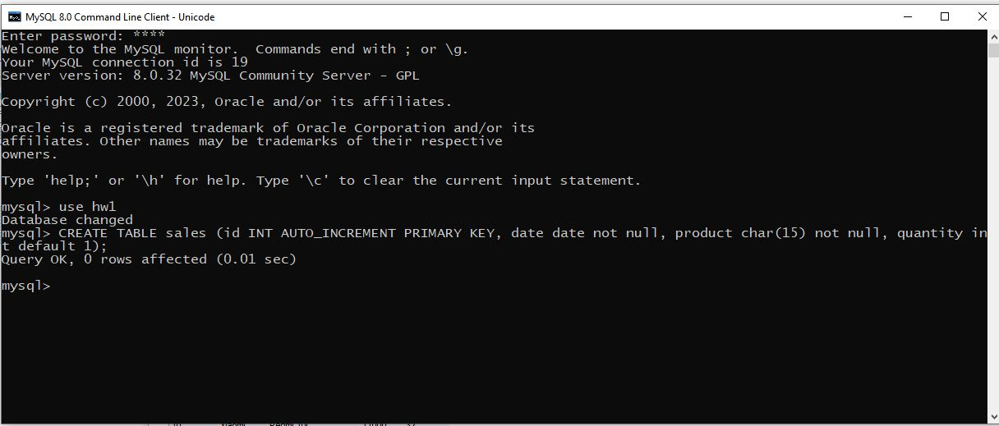
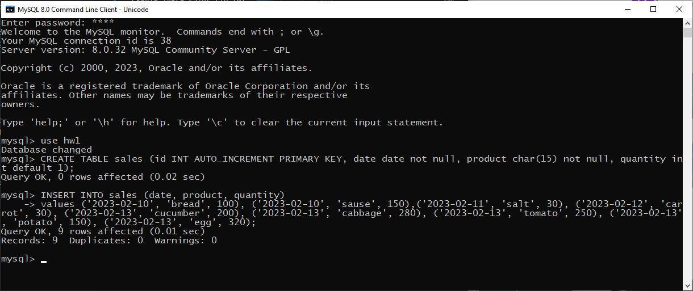
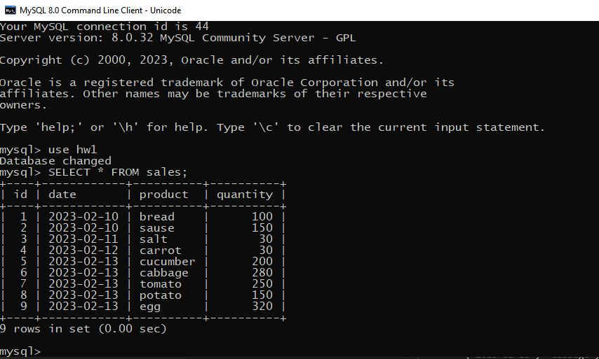
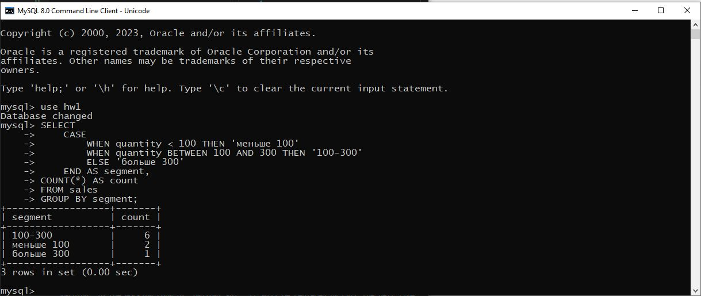
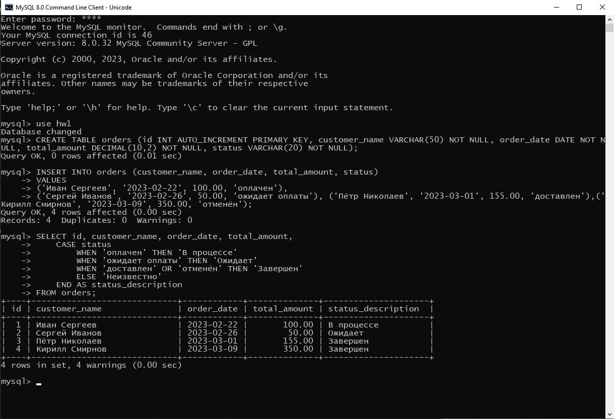

# ДЗ2

## Используя операторы языка SQL, создайте табличку “sales”. Заполните ее данными.

CREATE TABLE sales (id INT AUTO_INCREMENT PRIMARY KEY, date date not null, product char(15) not null, quantity int default 1);

INSERT INTO sales (date, product, quantity)
values ('2023-02-10', 'bread', 100), ('2023-02-10', 'sause', 150),('2023-02-11', 'salt', 30), ('2023-02-12', 'carrot', 30), ('2023-02-13', 'cucumber', 200), ('2023-02-13', 'cabbage', 280), ('2023-02-13', 'tomato', 250), ('2023-02-13', 'potato', 150), ('2023-02-13', 'egg', 320);

## Сгруппируйте значения количества в 3 сегмента — меньше 100, 100-300 и больше 300.

SELECT 
    CASE
        WHEN quantity < 100 THEN 'меньше 100'
        WHEN quantity BETWEEN 100 AND 300 THEN '100-300'
        ELSE 'больше 300'
    END AS segment, 
COUNT(*) AS count
FROM sales
GROUP BY segment;

## Создайте таблицу “orders”, заполните ее значениями. Покажите “полный” статус заказа, используя оператор CASE

CREATE TABLE orders (id INT AUTO_INCREMENT PRIMARY KEY, customer_name VARCHAR(50) NOT NULL, order_date DATE NOT NULL, total_amount DECIMAL(10,2) NOT NULL, status VARCHAR(20) NOT NULL);

INSERT INTO orders (customer_name, order_date, total_amount, status)
VALUES
('Иван Сергеев', '2023-02-22', 100.00, 'оплачен'),
('Сергей Иванов', '2023-02-26', 50.00, 'ожидает оплаты'), ('Пётр Николаев', '2023-03-01', 155.00, 'доставлен'),('Кирилл Смирнов', '2023-03-09', 350.00, 'отменён');

SELECT id, customer_name, order_date, total_amount,
    CASE status
        WHEN 'оплачен' THEN 'В процессе'
        WHEN 'ожидает оплаты' THEN 'Ожидает'
        WHEN 'доставлен' OR 'отменён' THEN 'Завершен'
        ELSE 'Неизвестно'
    END AS status_description
FROM orders;

## Чем NULL отличается от 0?

NULL - это отсутвие данных, а 0 - это числовые данные, равные 0.