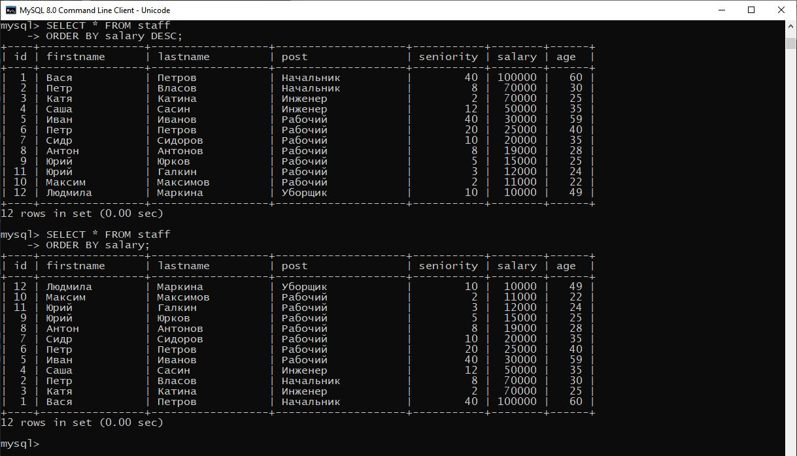

# ДЗ3

## Отсортируйте данные по полю заработная плата (salary) в порядке: убывания; возрастания.

**Убывания**

SELECT * FROM staff
ORDER BY salary DESC;

**Возрастания**

SELECT * FROM staff
ORDER BY salary;

## Выведите 5 максимальных заработных плат (saraly).

SELECT * FROM staff
ORDER BY salary DESC LIMIT 5;

## Посчитайте суммарную зарплату (salary) по каждой специальности (роst).

SELECT post, SUM(salary) FROM staff GROUP BY post;

## Найдите кол-во сотрудников с специальностью (post) «Рабочий» в возрасте от 24 до 49 лет включительно.

SELECT COUNT(*) FROM staff WHERE post = 'Рабочий' AND age BETWEEN 24 AND 49;

## Найдите количество специальностей

SELECT post FROM staff GROUP BY post;

SELECT COUNT(DISTINCT  post) FROM staff;

## Выведите специальности, у которых средний возраст сотрудников меньше 30 лет

SELECT post, AVG(age) as avg_age FROM staff  GROUP BY post HAVING avg_age < 30;

