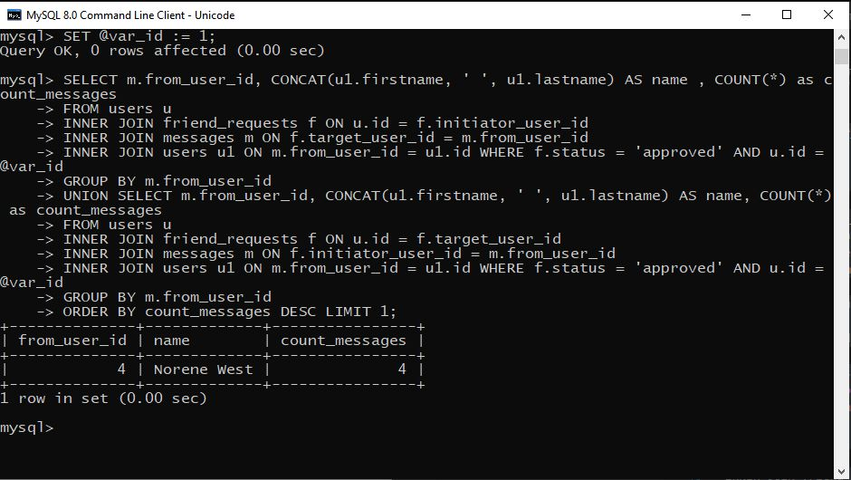

# ДЗ4

## Подсчитать общее количество лайков, которые получили пользователи младше 12 лет.

SELECT COUNT(*)
FROM likes l
INNER JOIN media m ON l.media_id = m.id
INNER JOIN users u ON u.id = m.user_id
INNER JOIN profiles p ON p.user_id = u.id
WHERE ((YEAR(CURRENT_DATE)-YEAR(p.birthday))-(RIGHT(CURRENT_DATE,5)<RIGHT(p.birthday,5))) < 12;

## Определить кто больше поставил лайков (всего): мужчины или женщины. 

SELECT p.gender, COUNT(*)
FROM likes l
INNER JOIN users u ON l.user_id = u.id
INNER JOIN profiles p ON p.user_id = u.id
GROUP BY gender;

## Вывести всех пользователей, которые не отправляли сообщения.

SELECT u.id, u.firstname, u.lastname, u.email
FROM messages m
RIGHT JOIN users u ON m.from_user_id = u.id WHERE m.from_user_id is NULL;

## Пусть задан некоторый пользователь. Из всех друзей этого пользователя найдите человека, который больше всех написал ему сообщений.

SET @var_id := 1;

**Выберем пользователя с id =1**

SELECT m.from_user_id, CONCAT(u1.firstname, ' ', u1.lastname) AS name , COUNT(*) as count_messages
FROM users u
INNER JOIN friend_requests f ON u.id = f.initiator_user_id
INNER JOIN messages m ON f.target_user_id = m.from_user_id
INNER JOIN users u1 ON m.from_user_id = u1.id WHERE f.status = 'approved' AND u.id = @var_id 
GROUP BY m.from_user_id
UNION SELECT m.from_user_id, CONCAT(u1.firstname, ' ', u1.lastname) AS name, COUNT(*) as count_messages
FROM users u 
INNER JOIN friend_requests f ON u.id = f.target_user_id
INNER JOIN messages m ON f.initiator_user_id = m.from_user_id 
INNER JOIN users u1 ON m.from_user_id = u1.id WHERE f.status = 'approved' AND u.id = @var_id 
GROUP BY m.from_user_id 
ORDER BY count_messages DESC LIMIT 1;

