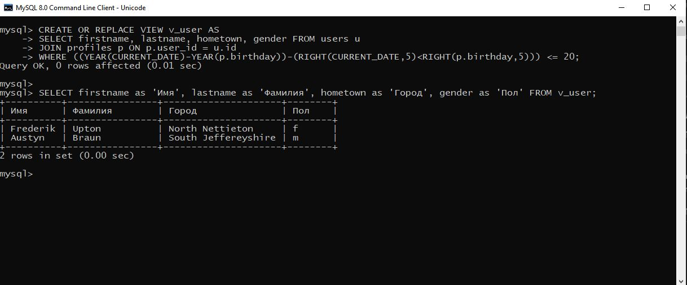
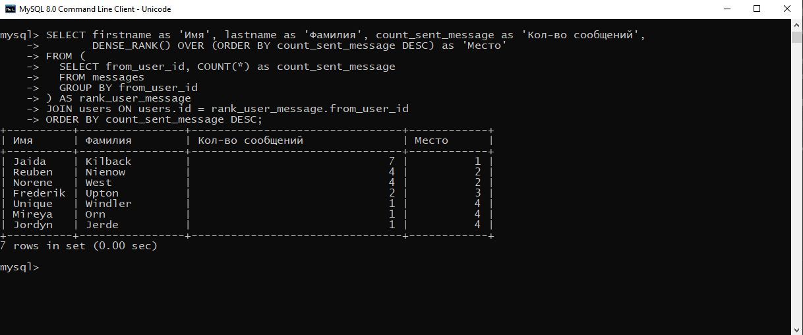
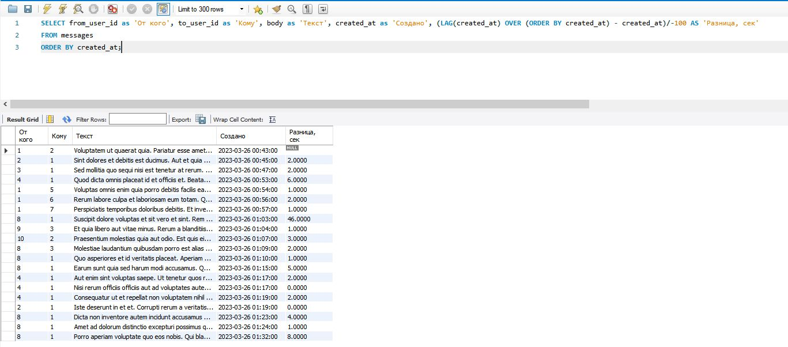

# ДЗ5
## 1. Создайте представление, в которое попадет информация о  пользователях (имя, фамилия, город и пол), которые не старше 20 лет.

CREATE OR REPLACE VIEW v_user AS
SELECT firstname, lastname, hometown, gender FROM users u
JOIN profiles p ON p.user_id = u.id
WHERE ((YEAR(CURRENT_DATE)-YEAR(p.birthday))-(RIGHT(CURRENT_DATE,5)<RIGHT(p.birthday,5))) <= 20;

SELECT firstname as 'Имя', lastname as 'Фамилия', hometown as 'Город', gender as 'Пол' FROM v_user;

## 2. Найдите кол-во,  отправленных сообщений каждым пользователем и  выведите ранжированный список пользователей, указав имя и фамилию пользователя, количество отправленных сообщений и место в рейтинге (первое место у пользователя с максимальным количеством сообщений) . (используйте DENSE_RANK)

SELECT firstname as 'Имя', lastname as 'Фамилия', count_sent_message as 'Кол-во сообщений',
       DENSE_RANK() OVER (ORDER BY count_sent_message DESC) as 'Место'
FROM (
  SELECT from_user_id, COUNT(*) as count_sent_message
  FROM messages
  GROUP BY from_user_id
) AS rank_user_message
JOIN users ON users.id = rank_user_message.from_user_id
ORDER BY count_sent_message DESC;

## 3. Выберите все сообщения, отсортируйте сообщения по возрастанию даты отправления (created_at) и найдите разницу дат отправления между соседними сообщениями, получившегося списка. (используйте LEAD или LAG)

SELECT from_user_id as 'От кого', to_user_id as 'Кому', body as 'Текст', created_at as 'Создано', (LAG(created_at) OVER (ORDER BY created_at) - created_at)/-100 AS 'Разница, сек'
FROM messages
ORDER BY created_at;

