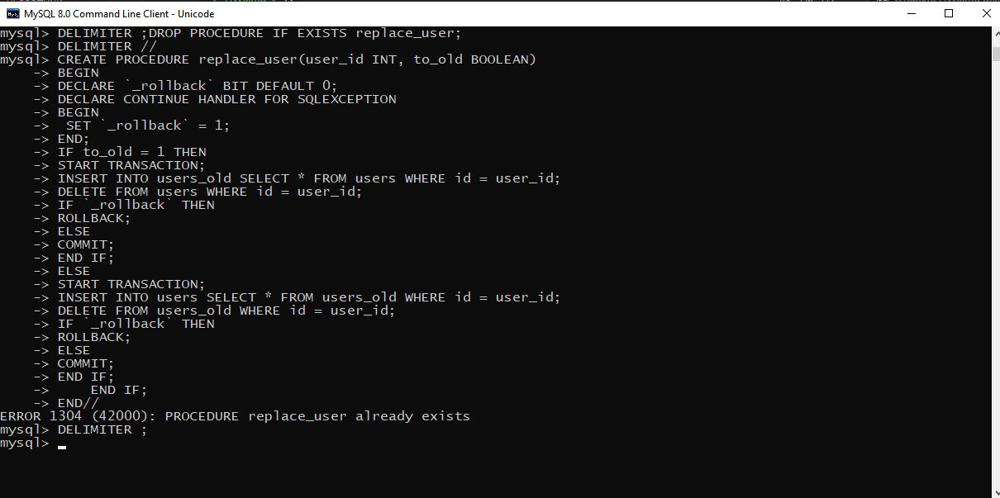
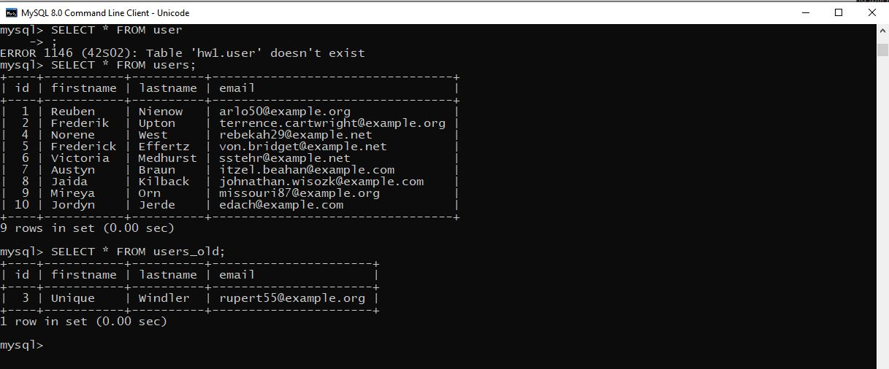
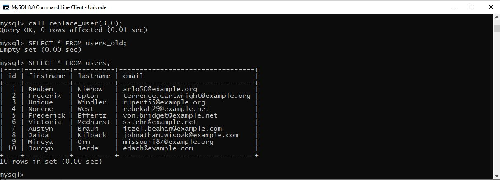
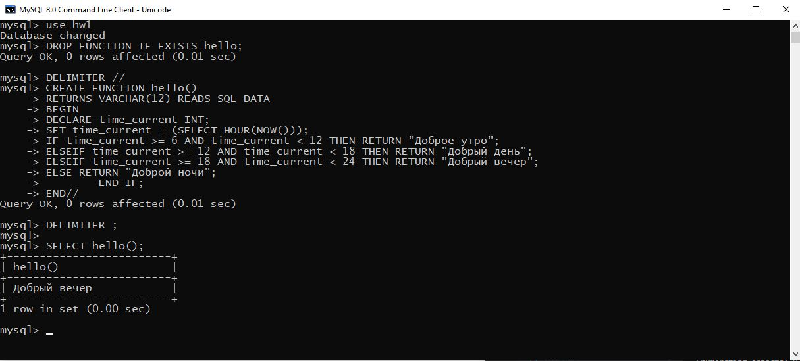
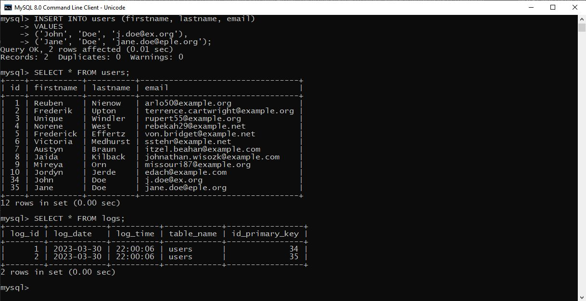
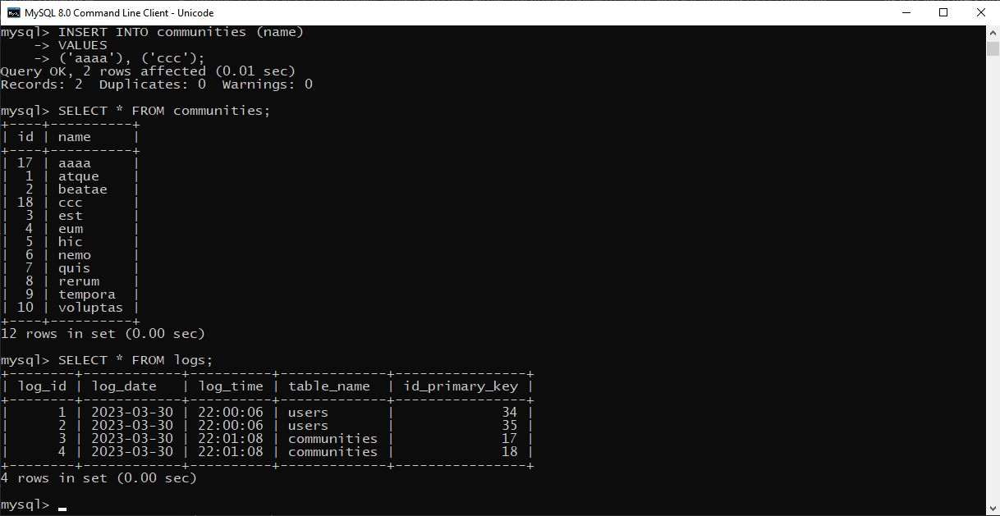
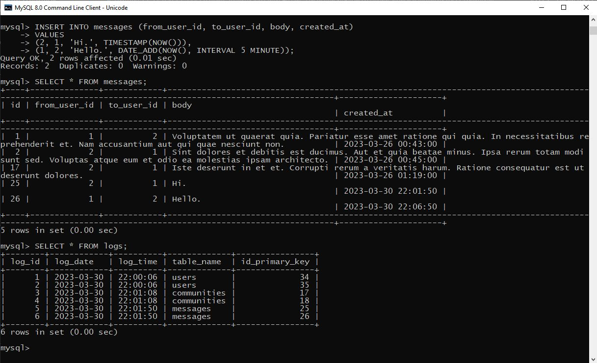

# ДЗ6
## Создайте таблицу users_old, аналогичную таблице users. Создайте процедуру,  с помощью которой можно переместить любого (одного) пользователя из таблицы users в таблицу users_old. (использование транзакции с выбором commit или rollback – обязательно).

-- Создание таблицы users_old, аналогичной таблице users
CREATE TABLE users_old (
    id SERIAL PRIMARY KEY,
    firstname VARCHAR(255),
    lastname VARCHAR(255),
    email VARCHAR(255)
);

-- Процедура,  с помощью которой можно переместить любого (одного) пользователя из таблицы users в таблицу users_old
DROP PROCEDURE IF EXISTS replace_user;
DELIMITER //
CREATE PROCEDURE replace_user(user_id INT, to_old BOOLEAN)
BEGIN
	DECLARE `_rollback` BIT DEFAULT 0;
	DECLARE CONTINUE HANDLER FOR SQLEXCEPTION
	BEGIN
 		SET `_rollback` = 1;
	END;
	IF to_old = 1 THEN
		START TRANSACTION;
			INSERT INTO users_old SELECT * FROM users WHERE id = user_id;
			DELETE FROM users WHERE id = user_id;        
		IF `_rollback` THEN
			ROLLBACK;
		ELSE
			COMMIT;
		END IF;
	ELSE
		START TRANSACTION;
			INSERT INTO users SELECT * FROM users_old WHERE id = user_id;
			DELETE FROM users_old WHERE id = user_id;        
		IF `_rollback` THEN
			ROLLBACK;
		ELSE
			COMMIT;
		END IF;
    END IF;
END//
DELIMITER ;

-- Вызов процедуры для перемещения в таблицу users_old
call replace_user(3,1);

-- Вызов процедуры для обратного перемещения
call replace_user(3,1);

## Создайте хранимую функцию hello(), которая будет возвращать приветствие, в зависимости от текущего времени суток. С 6:00 до 12:00 функция должна возвращать фразу "Доброе утро", с 12:00 до 18:00 функция должна возвращать фразу "Добрый день", с 18:00 до 00:00 — "Добрый вечер", с 00:00 до 6:00 — "Доброй ночи".

DROP FUNCTION IF EXISTS hello;
DELIMITER //
CREATE FUNCTION hello()
RETURNS VARCHAR(12) READS SQL DATA 
BEGIN
	DECLARE time_current INT; 
	SET time_current = (SELECT HOUR(NOW()));
		IF time_current >= 6 AND time_current < 12 THEN RETURN "Доброе утро";
		ELSEIF time_current >= 12 AND time_current < 18 THEN RETURN "Добрый день";
		ELSEIF time_current >= 18 AND time_current < 24 THEN RETURN "Добрый вечер";
		ELSE RETURN "Доброй ночи";
        END IF;
END//
DELIMITER ;

SELECT hello();

## Создайте таблицу logs типа Archive. Пусть при каждом создании записи в таблицах users, communities и messages в таблицу logs помещается время и дата создания записи, название таблицы, идентификатор первичного ключа.

DROP TABLE IF EXISTS logs;
CREATE TABLE logs (
       log_id INT AUTO_INCREMENT PRIMARY KEY,
       log_date DATE NOT NULL,
       log_time TIME NOT NULL,
       table_name VARCHAR(20)  NOT NULL,
       id_primary_key INT  NOT NULL);
DELIMITER //
DROP TRIGGER IF EXISTS logger_users//
DROP TRIGGER IF EXISTS logger_communities//
DROP TRIGGER IF EXISTS logger_messages//
CREATE TRIGGER logger_users
AFTER INSERT ON users FOR EACH ROW 
	BEGIN
		INSERT INTO logs(log_date, log_time, table_name, id_primary_key)
			VALUES(DATE(NOW()), TIME(NOW()), 'users', new.id);
	END//
CREATE TRIGGER logger_communities
AFTER INSERT ON communities FOR EACH ROW 
	BEGIN
		INSERT INTO logs(log_date, log_time, table_name, id_primary_key)
			VALUES(DATE(NOW()), TIME(NOW()), 'communities', new.id);
	END//
CREATE TRIGGER logger_messages
AFTER INSERT ON messages FOR EACH ROW
	BEGIN
		INSERT INTO logs(log_date, log_time, table_name, id_primary_key)
			VALUES(DATE(NOW()), TIME(NOW()), 'messages', new.id);
	END//
DELIMITER ;

INSERT INTO users (firstname, lastname, email) 
VALUES 
	('John', 'Doe', 'j.doe@ex.org'),
	('Jane', 'Doe', 'jane.doe@eple.org');

SELECT * FROM users;
SELECT * FROM logs;

INSERT INTO communities (name) 
VALUES 
	('aaaa'), ('ccc');

SELECT * FROM communities;
SELECT * FROM logs;

INSERT INTO messages (from_user_id, to_user_id, body, created_at) 
VALUES
	(2, 1, 'Hi.', TIMESTAMP(NOW())),
	(1, 2, 'Hello.', DATE_ADD(NOW(), INTERVAL 5 MINUTE));

SELECT * FROM messages;
SELECT * FROM logs;

